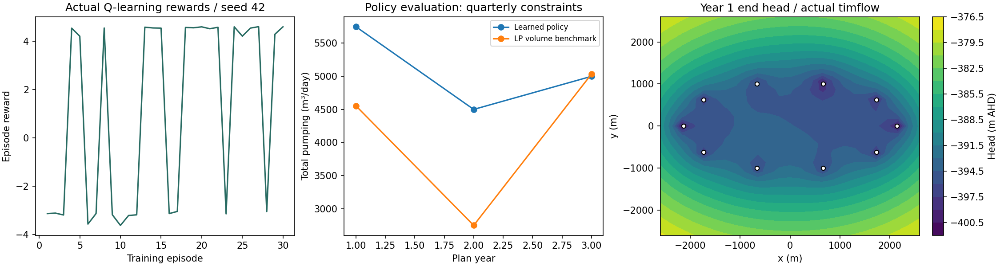

> Updated synthetic preset: initial head **−355 m AHD**, **K=0.05 m/day**, **S=0.01**, with a conventional minimum-excess-drawdown pumping schedule. **Fit water level** recomputes that schedule after edits; this preset is not an RL-trained result. See [parameter comparison](docs/target-fit.md).

> Current interface: one editable **10-year plan**, progressively simulated from day 0 to day 3650 at monthly sample points. Use **Run full simulation**, pause/resume, and edit the collapsed mine-plan settings. Bench elevations hold constant and step down at year-end entries; pumping history never resets at year boundaries. See [current simulation semantics](docs/reinforcement-learning.md#decisions-and-analytical-model). Historical quarterly descriptions and diagnostic artefacts below refer to earlier versions.

# HydroFly

## Can a fruit fly dewater a mine?

HydroFly is an intentionally unnecessary experiment combining analytical groundwater modelling, optimisation and an animated fly.

**Experimental and educational only. This is not a real mine-dewatering design tool.** The deliberately synthetic problem reduces confined-aquifer pressure beneath a pit footprint. It does not simulate pit seepage, slope stability or a moving water table.

## Open the interface

The main interface now includes an editable multi-year mine plan, 4–16 bores, annual rate inputs, an orbitable geological cutaway, an animated fly at a control computer and real reinforcement-learning telemetry.

**Run it in GitHub Codespaces:** open this repository, choose **Code → Codespaces → Create codespace on main**. The included dev-container installs Python and frontend dependencies, builds the interface and starts port 8000. Open the **HydroFly interface** forwarded port. This launch path is configured but has not yet been exercised in Codespaces; Codespaces usage is subject to your GitHub allowance and billing settings. It is a development workspace, not a public production demonstration.

1. Create/resize the borefield and set annual pit floors and rates.
2. Evaluate the plan; select a year to inspect its head surface and bore rates.
3. Choose a teaching strategy and train the fly. The reward plot, Q updates, exploration and target-success history are measured live.
4. Run the learned policy with guidance and exploration disabled. The fly operates one bore-year lever at a time. Compare it against the minimum-volume benchmark.
5. Export Excel to save the plan, recalculated results and recent learning statistics. Edit the workbook and use Import Excel to reload the plan; learning restarts.

The detailed [learning specification](docs/reinforcement-learning.md) defines every reward, update, constraint and limitation. The [interface reference record](docs/interface-references.md) documents the Awesome Fly inspiration and geology.

## Scientific scope and status

**Experimental and educational only. Not a real mine-dewatering design tool.** timflow.transient 0.5.0 remains the production groundwater engine. All displayed head vertices come from Python. Annual rate steps retain pumping history and recovery; quarterly pit controls use each year's floor minus 5 m. A year-end pressure-head mesh is not a water table or evidence of continuous compliance.

Super Pit-inspired reference shell: 3.78 × 1.61 km, 750 m deep, based on a dated 2022 closure study. Mine-life reference: 2034+. [Sources](docs/super-pit.md). Rock groups are illustrative and do not constitute a site-calibrated heterogeneous groundwater model. Default synthetic K=0.05 m/day, b=200 m, S=0.01, initial head −355 m AHD, aquifer roof −900 m AHD.

The version 0.2 single-year laboratory remains at `/classic.html`. Its independently verified single-well, superposition, recovery and conventional optimisation tests remain in the suite. Version 0.3 additionally tests annual-history response against directly scheduled timflow wells and actual Q-learning updates. The Python/API suite and four JavaScript tests validate the implementation locally, including actual UI handlers against the Python HTTP server (with only the renderer stubbed). Training can continue across batches. The production build passes; interactive rendered-browser QA, Codespaces launch and hosted Docker validation remain outstanding in this environment.

Repository: [CooperGarth/hydrofly](https://github.com/CooperGarth/hydrofly), currently private. The interactive Python application is live at [hydrofly.vercel.app](https://hydrofly.vercel.app/). `render.yaml` provides a Docker hosting blueprint; deployment requires a hosting account and approval of its compute charges.



## Run

With Python 3.12 and Node 22, from this directory:

```sh
python -m venv .venv
source .venv/bin/activate
pip install -r requirements-dev-lock.txt
pip install --no-deps -e .
pytest -q
npm ci --prefix web
node --test web/game-loop.test.js web/plan.test.js
npm run build --prefix web
python -m uvicorn hydrofly.api:app --host 0.0.0.0 --port 8000
```

Open http://localhost:8000. Windows activation: `.venv\Scripts\Activate.ps1`. Visitors to an eventual hosted deployment will not need to install Python. Container and publication instructions: [deployment](docs/deployment.md).

## Why not GitHub Pages yet?

timflow depends on Numba/LLVM, which lacks a supported standard Pyodide installation path in the reviewed catalogue. A universal timflow wheel does not make that dependency graph browser-compatible. HydroFly therefore uses a small native Python service. No JavaScript Theis replacement or unverified dependency stub is used to force static hosting.

The [engine decision](docs/engine-decision.md) compares timflow, TTim, TimML and AnaFlow. The [deployment decision](docs/deployment-decision.md) distinguishes documented dependency barriers from unperformed browser benchmarks.

## Documentation

- [Super Pit reference and synthetic level](docs/super-pit.md)
- [Fly strategy and game loop](docs/fly-strategy.md)
- [Groundwater theory and units](docs/theory.md)
- [Conceptual model and assumptions](docs/assumptions.md)
- [Objective function and physical-time semantics](docs/objective.md)
- [Architecture and future agent interface](docs/architecture.md)
- [Numerical verification and remaining checks](docs/verification.md)
- [Package research and decision](docs/engine-decision.md)
- [Deployment instructions](docs/deployment.md)

Generate evidence with `python scripts/diagnostics.py` and `python scripts/learning_diagnostics.py`. CI runs numerical tests, diagnostics, the frontend build and a container build. Source is licensed under [MIT](LICENSE). timflow, AnaFlow and other dependencies retain their own licences. Contributions should add evidence and tests before expanding the visual or hydrogeological claims.

## Next experiment

First complete browser QA and public hosting. Then introduce a history-aware controller with a pre-dewatering and operating phase, additional aquifer layers/boundaries, and environmental receptors. The Q-learning experiment now sits alongside that baseline; broader generalisation and biological connectome experiments remain future work.

### Vercel

Import this repository with the **FastAPI** preset and the root directory left at `./`. See [Vercel setup and acceptance checks](docs/deployment.md#vercel-import-prepared-deployment-not-yet-verified). Configuration is prepared; a public deployment has not yet been verified.

The main console now prioritises the mine scene, fly controller monitor and a quarterly water-level versus bench-progression graph. Mine-plan and strategy settings are collapsed initially. The graph shows Python-calculated pit heads, annual floor elevations and the five metre clearance target; it updates during training and learned-policy operation.

Three scenarios are available: minimise synthetic pumping cost, total pumping rate, or excess drawdown below the pit target. All retain the floor-minus-5-m target. See [exact objectives and reward definitions](docs/reinforcement-learning.md). The water-level graph is also displayed on the fly’s desk and background monitors. Older learning diagnostic artefacts are historical and predate these reward/default changes.

Bench schedule update: the initial floor applies from day 0 until just before day 365. The first entered floor applies at day 365, the second at day 730, and so on; the final entry applies at day 3650. Both chart displays and the model target use these right-continuous steps. Pumping history and modelled head remain continuous across the bench change; feasibility uses the new target at the change instant. Changing this schedule alters optimisation constraints, so retrain existing policies.

### Learning-controller repair

Training now preserves the best plan, shares seven learned action-value weights across pumping decisions, and backtracks rate changes near constraints. Batches default to 100 episodes, with an option to train until paused. The frozen policy uses an explicit analytical improvement safeguard; the conventional LP remains the benchmark. The fitted default is already optimised for drawdown: use **Start from uniform pumping** for a learning challenge. See [controller methods](docs/reinforcement-learning.md), [measured results and limitations](docs/learning-verification.md), and the reproducible `scripts/verify_learning.py` diagnostic.

The water-level dashboard now shows peak sampled drawdown, the reach of the 1 m drawdown contour, cumulative pumped volume and synthetic operating cost. Values accumulate during playback. See [metric definitions and the dashboard button audit](docs/dashboard-statistics.md).

New to the game? Open **How to play** at the top of the dashboard or read the [full playing guide](docs/how-to-play.md).
