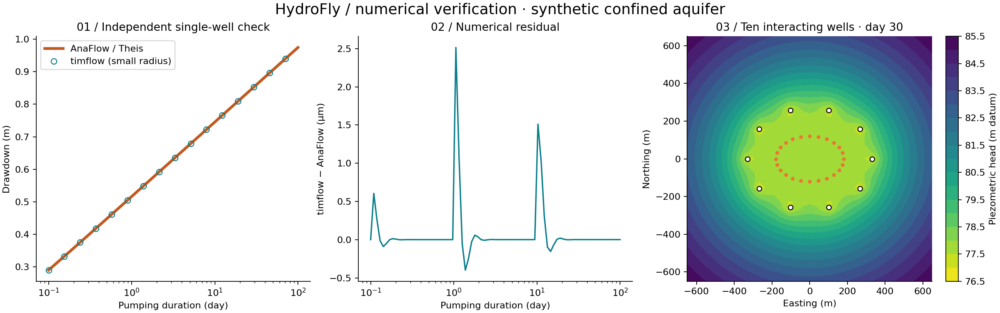

# HydroFly

## Can a fruit fly dewater a mine?

HydroFly is an intentionally unnecessary experiment combining analytical groundwater modelling, optimisation and an animated fly.

**Experimental and educational only. This is not a real mine-dewatering design tool.** The deliberately synthetic problem reduces confined-aquifer pressure beneath a pit footprint. It does not simulate pit seepage, slope stability or a moving water table.

## Current status

The first milestone is complete: a scientifically checked Python transient model with ten controllable wells and reproducible 2-D plots. A manual/optimiser/HydroFly web frontend, Python API and deployment package are also implemented.

- Engine: **timflow.transient 0.5.0**, the actively developed successor to TTim.
- Independent verification: AnaFlow's Theis solution, finite-radius convergence, multi-well superposition, pumping shut-off and recovery.
- Optimiser: SciPy SLSQP with hard pit-head constraints and a HiGHS feasibility check.
- Display: Three.js head mesh and contours derived from actual Python results, pit terraces, pumping indicators and an animated fly.
- Repository: [CooperGarth/hydrofly](https://github.com/CooperGarth/hydrofly). It is currently private. The interactive Python application is not yet publicly deployed; no compatible Python hosting deployment connection is configured.
- Frontend production build, 23 Python/API tests, three JavaScript controller tests and a real HTTP smoke check passed locally. Interactive browser/rendering QA is outstanding: the session's cloud browser could not open its local Python server. Docker build is also outstanding because no Docker executable was available. CI is provided but has not run on GitHub.



## The experiment

The default game level uses a **Super Pit-inspired planned shell: 3.78 × 1.61 km, 750 m deep**, based on a dated 2022 closure study. Mine-life context is **2034+**, not a fixed shutdown date. [Sources and distinctions](docs/super-pit.md).

The hydraulic system is deliberately synthetic: initial head −365 m AHD, pit floor −390 m AHD, target −395 m AHD, K=0.2 m/day, b=200 m, T=40 m²/day, S=0.001, ten wells capped at 6,000 m³/day, assessment after 365 days. The model represents an already partly dewatered confined pressure-head challenge, not the real mine's water table or fractured-rock system.

The default greedy fly reaches the sampled target in 13 moves using **5,343.75 m³/day**; the conventional benchmark uses approximately **5,128.93 m³/day**. The fly's single-well strategy stops locally and does not guarantee a global optimum. A Classic laboratory level retains the original independently verified 80 m-floor example.

## Operating modes

1. **Manual:** adjust well rates; Python evaluates the constant-rate scenario.
2. **Optimiser:** conventional SLSQP/HiGHS benchmark with hard pit constraints.
3. **HydroFly:** enter a strategy; the fly decides, travels to a well, changes that pump, checks the Python response and decides again. Pause/resume and one-move controls are included. No precomputed optimiser replay and no RL.

Strategies support greedy deficit reduction, a custom well patrol order, and protecting the wettest control, with editable step size, minimum step, trimming and move budget. [Strategy contract](docs/fly-strategy.md). The JSON editor accepts this bounded configuration; it does not execute arbitrary code or interpret natural-language programmes.

Each move changes a candidate constant-rate design at the chosen duration. Flight time and move count are not elapsed groundwater time. General pumping histories remain available in the Python engine and are covered by recovery tests.

## Run

With Python 3.12 and Node 22, from this directory:

```sh
python -m venv .venv
source .venv/bin/activate
pip install -r requirements-dev-lock.txt
pip install --no-deps -e .
pytest -q
node --test web/game-loop.test.js
npm ci --prefix web
npm run build --prefix web
python -m uvicorn hydrofly.api:app --host 0.0.0.0 --port 8000
```

Open http://localhost:8000. Windows activation: `.venv\Scripts\Activate.ps1`. Visitors to an eventual hosted deployment will not need to install Python. Container and publication instructions: [deployment](docs/deployment.md).

## Why not GitHub Pages yet?

timflow depends on Numba/LLVM, which lacks a supported standard Pyodide installation path in the reviewed catalogue. A universal timflow wheel does not make that dependency graph browser-compatible. HydroFly therefore uses a small native Python service. No JavaScript Theis replacement or unverified dependency stub is used to force static hosting.

The [engine decision](docs/engine-decision.md) compares timflow, TTim, TimML and AnaFlow. The [deployment decision](docs/deployment-decision.md) distinguishes documented dependency barriers from unperformed browser benchmarks.

## Documentation

- [Super Pit reference and synthetic level](docs/super-pit.md)
- [Fly strategy and game loop](docs/fly-strategy.md)
- [Groundwater theory and units](docs/theory.md)
- [Conceptual model and assumptions](docs/assumptions.md)
- [Objective function and physical-time semantics](docs/objective.md)
- [Architecture and future agent interface](docs/architecture.md)
- [Numerical verification and remaining checks](docs/verification.md)
- [Package research and decision](docs/engine-decision.md)
- [Deployment instructions](docs/deployment.md)

Generate evidence with `python scripts/diagnostics.py`. CI runs numerical tests, diagnostics, the frontend build and a container build. Source is licensed under [MIT](LICENSE). timflow, AnaFlow and other dependencies retain their own licences. Contributions should add evidence and tests before expanding the visual or hydrogeological claims.

## Next experiment

First complete browser QA and public hosting. Then introduce a history-aware controller with a pre-dewatering and operating phase, additional aquifer layers/boundaries, and environmental receptors. Only after a validated conventional baseline should reinforcement learning replace the agent policy.
